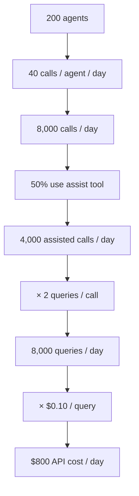
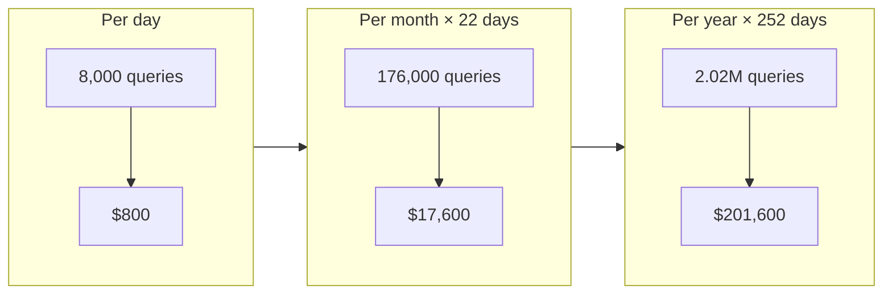
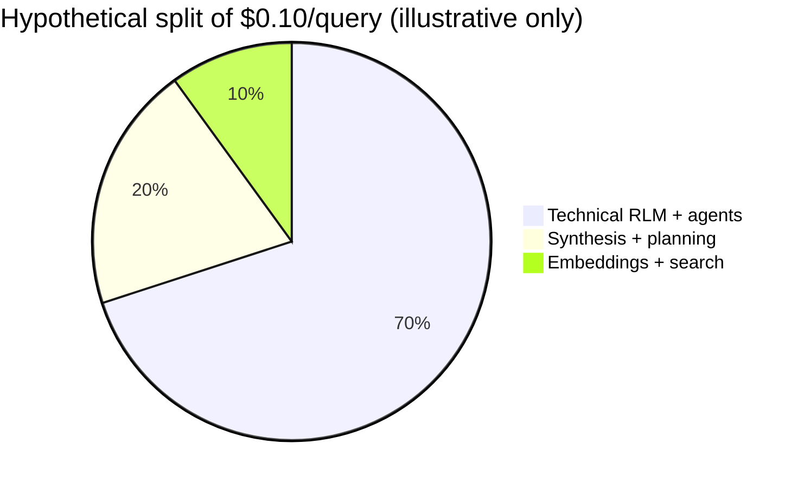

# Diagrams — call center API cost

Paste into Mermaid Live Editor or any Markdown viewer with Mermaid support.

## 1. Volume funnel (queries per day)



## 2. Monthly cost waterfall (22 working days)



## 3. Cost split (illustrative — if unbundling later)



*Pie is for discussion only; your pilot should replace with measured splits.*

## 4. Sensitivity — monthly API cost (22 days)

```mermaid
xychart-beta
  title "Monthly API cost vs. usage rate (200 agents, 40 calls, 2 queries, $0.10)"
  x-axis [25%, 50%, 75%, 100%]
  y-axis "USD (thousands)" 0 --> 36
  bar [8.8, 17.6, 26.4, 35.2]
```

*At 50% usage → $17.6k/month. At 25% → $8.8k; at 100% → $35.2k.*
