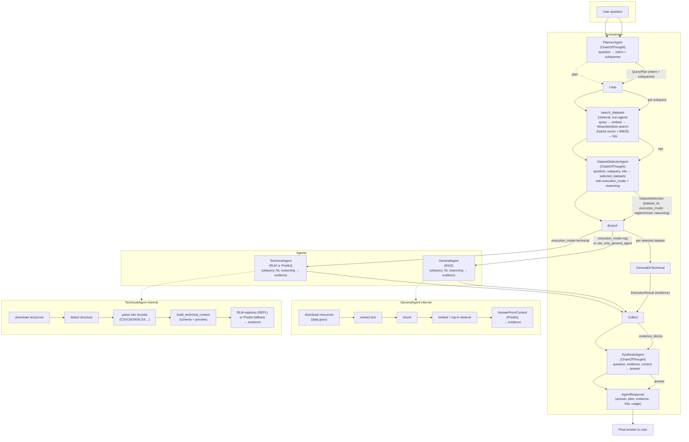
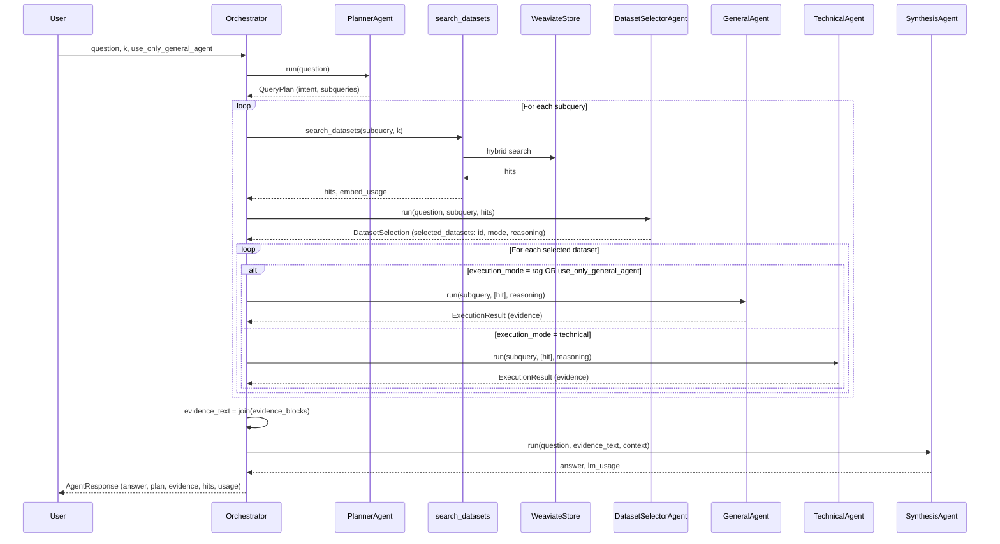

# Agora pipeline — agent structure and data flow

This diagram reflects the current setup in `src/backend/app/agents/orchestrator.py` and related agents.

## Mermaid flowchart

## Simplified sequence (who calls whom)

## Data types at boundaries

| Step | Input | Output |
|------|--------|--------|
| **PlannerAgent** | `question: str` | `QueryPlan` (intent, subqueries[], lm_usage) |
| **search_datasets** | `query_text: str`, `k`, `alpha` | `(hits: list[dict], embed_usage)` |
| **DatasetSelectorAgent** | `question`, `subquery`, `hits` | `DatasetSelection` (selected_datasets: dataset_id, execution_mode, reasoning; lm_usage) |
| **GeneralAgent** | `subquery`, `datasets` (hits), `dataset_reasoning` | `ExecutionResult` (mode=rag, subquery, evidence, lm_usage, embed_usage) |
| **TechnicalAgent** | `subquery`, `hits`, `dataset_reasoning` | `ExecutionResult` (mode=technical, subquery, evidence, lm_usage) |
| **SynthesisAgent** | `question`, `evidence` (concatenated blocks), `context` | `(answer: str, lm_usage)` |
| **Orchestrator** | `question`, `k`, `use_only_general_agent` | `AgentResponse` (answer, plan, evidence[], hits, user_messages, lm_usage_grand_total, embed_usage_grand_total) |

## One-line pipeline summary

**Question → Planner (subqueries) → [per subquery: search_datasets (hits) → DatasetSelector (rag/technical per dataset) → GeneralAgent or TechnicalAgent (evidence)] → concatenate evidence → SynthesisAgent (answer) → AgentResponse.**
